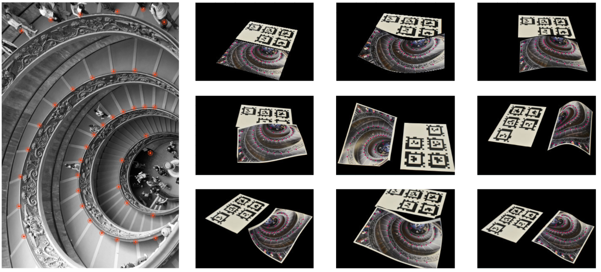

## Bramante39M Dataset

**Bramante39M** is a large-scale dataset introduced in our paper for advancing research in **camera localisation** under challenging deformation and motion conditions. It provides a challenging benchmark for evaluating algorithms that disentangle camera motion from object deformation. The dataset is being introduced in the context of Shape-from-Template (S*f*T) and Non Rigid Structure-from-Motion (NR-S*f*M), but can also be utilised for deformable Simultaneous Localization and Mapping (deformable SL*a*M) approaches.



### Key Features
- **39 million deformation pathways** across varying baseline magnitudes
- Includes both S*f*T (template-based) and NR-S*f*M (template-less) settings
- Provides realistic but challenging deformable scenes with controlled variations
- Provides both **pose ground-truth** and **deformation ground-truth**
- Designed to test robustness under **As-Static-As-Possible (ASAP)** constraints, but future research may benchmark against our accuracies

### Dataset Statistics
- **Total deformed poses:** 9
- **Total images:** 64  
- **Total pathways:** ~39 million
- **Scene types:** Template-based, template-less, hybrid  
- **Groundtruth:** Camera poses, object deformations, template, keypoint correspondences
- **Scale:** Room-scaled camera motion, deforming object is an A4-sized paper


### Applications
- Benchmarking **NRS*f*M** and **S*f*T** algorithms
- Studying ambiguity of camera pose under isometric deformations
- Benchmarking **deformable SL*a*M** algorithms
- Evaluating robustness of **ASAP** priors
- Learned camera pose estimation in deformable scenes


---
The pre-print of our article is availble at: https://encov.ip.uca.fr/publications/pubfiles/2025_Bartoli_etal_CVIU_pose.pdf

If you use **Bramante39M** in your research, please cite our paper:

```bibtex
@article{bartoli2025,
  title   = {Camera Pose in SfT and NRSfM under Isometric and Weaker Deformation Models},
  author  = {Adrien Bartoli, Agniva Sengupta},
  journal = {Computer Vision and Image Understanding},
  year    = {2025}
}
